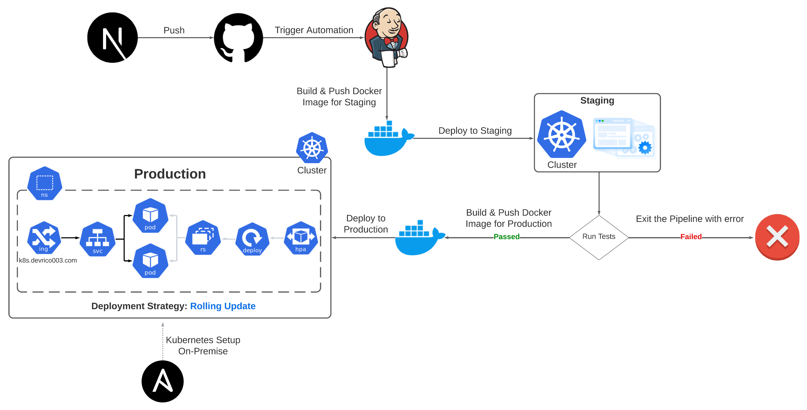
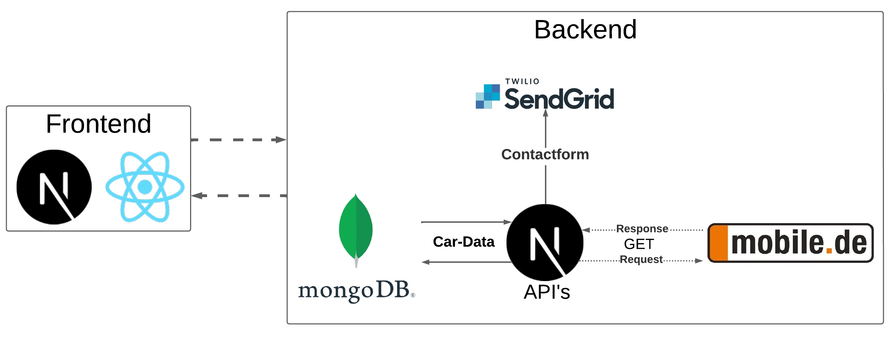

# Next.js Full-Stack Application for Car Dealership

This repository houses a Full-Stack application designed for car dealerships, developed with Next.js. It employs Kubernetes for orchestration and Jenkins for Continuous Integration/Continuous Deployment (CI/CD), ensuring an efficient, scalable, and automated deployment pipeline.

## Overview

The application is tailored to streamline car dealership operations, integrating front-end and back-end services. Kubernetes manages containerized application deployment, scaling, and operations, while Jenkins automates the build, test, and deployment processes, enabling a seamless CI/CD workflow.

## Features

- Full-Stack Next.js application
- CI/CD automation with Jenkins
- Kubernetes manifests for scalable and resilient deployment
- Ansible playbooks for initial setup, including VPS, Kubernetes cluster, and Jenkins
- Unit testing to ensure code quality
- Metric Server for dynamic scaling with Horizontal Pod Autoscaler

## Repository Structure

- `__tests__`: Contains unit tests.
- `ansible`: Includes playbooks for initial VPS, Kubernetes cluster setup, Jenkins installation, and Jenkins agent setup.
- `k8s`: Holds Kubernetes manifests for deploying the Next.js app, MongoDB, Jenkins, and configurations for Metric Server, Ingress, and MetalLB.

## CI/CD and Application Architecture

### CI/CD Pipeline Architecture



### Application Architecture



## Getting Started

### Prerequisites

- A Kubernetes cluster
- Jenkins for CI/CD
- Docker for containerization
- Ansible for automation setup
- Nodejs 18^

### Initial Setup

1. **VPS and Kubernetes Cluster Setup**: Utilize the Ansible playbooks in the `ansible` directory for initial setup, including VPS configuration, Kubernetes cluster, and Jenkins installation.

2. **Application Deployment**: Apply the Kubernetes manifests from the `k8s` directory to deploy the Next.js app, MongoDB, and Jenkins as required. 
```bash 
kubectl apply -f k8s/
```
3. **CI/CD Pipeline Configuration**: The `Jenkinsfile` outlines the pipeline. Configure it in Jenkins to automate your deployment process.

## Running the Application Locally

For local development, you can start the Next.js app using `npm run dev`.

### Starting the Next.js App Locally

```bash
git clone https://github.com/DevRico003/next-carcenter-erding-k8s
cd next-carcenter-erding-k8s
npm install
npm run dev
```

Open [http://localhost:3000](http://localhost:3000) with your browser to see the result.

[API routes] 

### To connect with the mobile.de API you need the mobile.de seller credentials.

- Can be accessed on [http://localhost:3000/api/mobile](http://localhost:3000/api/mobile). This endpoint can be edited in `pages/api/mobile.js`. This API retrieves car data from the mobile.de API, processes and transforms the data, and then stores it in a MongoDB database.

- Can be accessed on [http://localhost:3000/api/fetchCarImages](http://localhost:3000/api/fetchCarImages). This endpoint can be edited in `pages/api/fetchCarImages.js`. This API retrieves car images from the mobile.de API, processes and transforms the data, and then stores it in a MongoDB database.

The `pages/api` directory is mapped to `/api/*`. Files in this directory are treated as [API routes](https://nextjs.org/docs/api-routes/introduction) instead of React pages.

This project uses [`next/font`](https://nextjs.org/docs/basic-features/font-optimization) to automatically optimize and load Inter, a custom Google Font.

## License

This project is licensed under the Apache License 2.0 - see the [LICENSE](LICENSE) file for details or visit [http://www.apache.org/licenses/LICENSE-2.0](http://www.apache.org/licenses/LICENSE-2.0) for more information.


